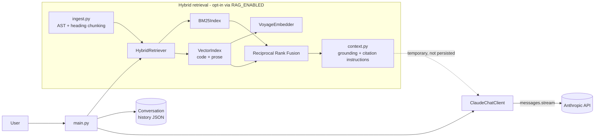

# Claude Chat CLI with Hybrid RAG Retrieval

[](https://github.com/henrymbuguak/claude-with-the-anthropic-api/actions/workflows/ci.yml)
[](LICENSE)


A multi-turn Claude chat CLI, extended with a hybrid retrieval-augmented
generation (RAG) system built from scratch — no `rank-bm25`, no FAISS.
Retrieval, generation, and evaluation are separated into small, independently
tested modules rather than one monolithic script.

**What this project demonstrates:**

- A streaming, multi-turn chat client over the Anthropic Messages API, with
  native web search, citation extraction, unified error handling, and
  optional extended thinking whose token budget is validated against
  `max_tokens` and shared with the prompt evaluation harness.
- A hybrid RAG pipeline implemented from first principles: AST-aware code/doc
  chunking, Okapi BM25, Voyage AI embeddings with a local cosine-similarity
  vector index, and Reciprocal Rank Fusion to merge rankings from incompatible
  scoring spaces.
- **End-to-end integration, not just a retrieval demo** — retrieved chunks are
  formatted into a grounding prompt with citation and abstention instructions,
  sent to Claude for a single turn, and never persisted to conversation
  history, so the retrieval step can't leak untrusted source text into future
  turns.
- A prompt evaluation harness (rule-based checks + LLM-as-judge scoring) used
  to A/B test system prompt revisions before adopting them.
- 97 tests, `ruff`-clean, and CI running both on every push.

## CLI Demo

<p align="center">
  <a href="docs/cli-demo.mp4">
    
  </a>
</p>

The animation shows the normal `uv run python main.py` workflow. Select it to
open the MP4 version.

## Architecture



The retrieval path is opt-in and additive: with `RAG_ENABLED=false` (the
default), `main.py` behaves exactly like a plain streaming chat client.

## Project Layout

```
app/
  config.py            # Settings dataclass, loaded/validated from .env
  conversation.py       # Persisted multi-turn message history
  claude_client.py      # Anthropic SDK wrapper: streaming, citations, error handling
  tools/web_search.py   # Native Anthropic web search tool definition
  rag/                  # Hybrid RAG retrieval + chat integration (see below)
main.py                 # CLI entry point
prompts/                # Versioned system prompt files
eval/                   # Prompt evaluation harness (cases, evaluators, runner, results)
tests/                  # pytest suite (unit tests for every module above)
.github/workflows/      # CI: ruff + pytest on every push/PR
```

## Example session

```
Type your question, or 'exit' to end the conversation.

You: How is conversation history persisted between runs?
Claude: Conversation history is stored as a list of {"role", "content"}
dicts and saved to JSON after every turn [app/conversation.py#class-Conversation].
Since the Anthropic API itself is stateless, the full message list is replayed
on every request so Claude "remembers" prior turns.

Local sources:
[1] app/conversation.py#class-Conversation
[2] main.py#function-run_chat_loop
```

(RAG mode: `RAG_ENABLED=true`. Without it, the CLI behaves like a plain
streaming chat client with no local sources printed.)

## Hybrid RAG retrieval

The retrieval system lives in `app/rag/` and is composed of independently
tested stages rather than a single opaque pipeline:

- `ingest.py` chunks Python at top-level function/class boundaries and Markdown
  at headings, while preserving source metadata for citations.
- `index_bm25.py` implements Okapi BM25 and tokenizes complete code identifiers
  plus their snake_case and camelCase components.
- `rrf.py` implements Reciprocal Rank Fusion for combining independent rankings
  without comparing incompatible retriever scores.
- `embed_voyage.py` selects `voyage-code-3` for code and `voyage-4` for prose,
  batches requests, and normalizes vectors for cosine similarity.
- `index_vector.py` provides exact local vector search and keeps code/prose model
  spaces separate before RRF merges their rankings.

### Try retrieval directly

Run a BM25 retrieval experiment over this repository:

```powershell
uv run python -m app.rag.demo "allowed_domains max_uses WebSearchTool20260209Param"
```

The command prints each result's rank, BM25 score, stable chunk ID, and preview.
Try natural-language questions and change the number of displayed results:

```powershell
uv run python -m app.rag.demo "How is conversation history saved?"
uv run python -m app.rag.demo "Where are duplicate web citations removed?"
uv run python -m app.rag.demo "How is the system prompt loaded from a file?" --top-k 10
```

Install the official Voyage client with uv and add your key only to `.env`:

```powershell
uv add voyageai
uv run python -c "import voyageai; print('Voyage AI ready')"
```

```dotenv
VOYAGE_API_KEY=your-real-voyage-key
```

Verify one small live API request, build cached code/prose indexes, and compare
retrieval modes:

```powershell
uv run python -m app.rag.smoke_voyage
uv run python -m app.rag.build_index
uv run python -m app.rag.demo "How is conversation history saved?" --mode bm25
uv run python -m app.rag.demo "How is conversation history saved?" --mode vector
uv run python -m app.rag.demo "How is conversation history saved?" --mode hybrid
```

Use `--rebuild` only when you intentionally want to ignore cached embeddings:

```powershell
uv run python -m app.rag.build_index --rebuild
```

Generated indexes and the embedding cache live in `.rag-index/` and are excluded
from git. Indexing uses `input_type="document"`; searches use
`input_type="query"`. The application never prints or stores your Voyage key in
the index.

Run the focused RAG tests:

```powershell
uv run pytest tests/test_rag_ingest.py -v
uv run pytest tests/test_rag_bm25.py -v
uv run pytest tests/test_rag_rrf.py -v
uv run pytest tests/test_rag_config.py tests/test_rag_embed_voyage.py -v
uv run pytest tests/test_rag_index_vector.py tests/test_rag_embedding_cache.py -v
uv run pytest tests/test_rag_build_index.py tests/test_rag_retriever.py -v
```

Run the complete project suite and lint the RAG implementation:

```powershell
uv run pytest -q
uv run ruff check app/rag tests/test_rag_ingest.py tests/test_rag_bm25.py tests/test_rag_rrf.py
```

### Benchmark retrieval quality

The labeled cases in `eval/rag_cases.jsonl` measure Hit@k, Recall@k, and mean
reciprocal rank against stable chunk IDs. Run the deterministic BM25 baseline
without API access:

```powershell
uv run python -m eval.rag_retrieval
```

After building vector indexes and setting `VOYAGE_API_KEY`, compare every mode
on the same queries:

```powershell
uv run python -m eval.rag_retrieval --modes bm25 vector hybrid --top-k 5
```

The evaluator rejects stale labels when ingestion changes a chunk ID, so a
benchmark cannot silently report misleading misses after corpus changes.

Inspect the generated chunk IDs directly:

```powershell
uv run python -c "from pathlib import Path; from app.rag.ingest import chunk_python; chunks = chunk_python(Path('app/claude_client.py'), Path.cwd()); print('\n'.join(chunk.chunk_id for chunk in chunks))"
```

This exercises `files -> chunks -> BM25 + model-specific vectors -> RRF`. Code
and prose vectors are never compared directly because they come from different
embedding spaces.

### End-to-end RAG chatbot

Set `RAG_ENABLED=true` to make the CLI chatbot retrieve from this repository
before answering. Each turn: the question is searched with `HybridRetriever`,
the top chunks are formatted into a grounding block with citation and
abstention instructions (`app/rag/context.py`), and only that single API call
is augmented - `conversation_history.json` still stores just the plain
question and Claude's answer, never the injected source text.

```powershell
# .env
RAG_ENABLED=true
RAG_CHAT_MODE=bm25      # or vector / hybrid (both require VOYAGE_API_KEY and built indexes)
RAG_CHAT_TOP_K=5
RAG_CONTEXT_CHAR_BUDGET=6000
```

For `vector` or `hybrid` chat modes, build the indexes first:

```powershell
uv run python -m app.rag.build_index
uv run python main.py
```

Retrieved source text is treated as untrusted: the grounding instructions
explicitly tell Claude to ignore any instructions embedded inside a source and
to answer "insufficient information" when the retrieved chunks don't cover the
question. Retrieved chunk ids are printed as `Local sources:` after each answer.

## Dependencies

This project is managed with [uv](https://github.com/astral-sh/uv). Dependencies are declared in `pyproject.toml` and pinned in `uv.lock` (both committed for reproducible installs). A `requirements.txt` is also generated for anyone using plain `pip`:

```powershell
uv export --no-hashes --no-dev -o requirements.txt
```

## Setup

1. **Install dependencies** (using uv):

   ```powershell
   uv sync
   ```

   Or with pip:

   ```powershell
   python -m venv .venv
   .venv\Scripts\Activate.ps1
   pip install -r requirements.txt
   ```

2. **Configure your environment** — copy `.env.example` to `.env` and fill in your API key:

   ```powershell
   Copy-Item .env.example .env
   ```

   | Variable                               | Required | Default                     | Description                                                                      |
   | -------------------------------------- | -------- | --------------------------- | -------------------------------------------------------------------------------- |
   | `ANTHROPIC_API_KEY`                    | Yes      | —                           | Your Anthropic API key                                                           |
   | `VOYAGE_API_KEY`                       | For RAG  | —                           | Voyage key for semantic indexing and retrieval                                   |
   | `RAG_CODE_EMBEDDING_MODEL`             | No       | `voyage-code-3`             | Voyage model used for code chunks                                                |
   | `RAG_PROSE_EMBEDDING_MODEL`            | No       | `voyage-4`                  | Voyage model used for prose chunks                                               |
   | `RAG_EMBEDDING_DIMENSION`              | No       | `1024`                      | Vector dimensions: 256, 512, 1024, or 2048                                       |
   | `RAG_EMBEDDING_BATCH_SIZE`             | No       | `64`                        | Number of chunk texts per embedding request                                      |
   | `RAG_INDEX_DIR`                        | No       | `.rag-index`                | Generated vector indexes and embedding cache                                     |
   | `RAG_ENABLED`                          | No       | `false`                     | Turns the CLI chatbot into an end-to-end RAG chatbot                             |
   | `RAG_CHAT_MODE`                        | No       | `hybrid`                    | Retrieval mode for chat: `bm25`, `vector`, or `hybrid`                           |
   | `RAG_CHAT_TOP_K`                       | No       | `5`                         | Retrieved chunks used as grounding context per question                          |
   | `RAG_CONTEXT_CHAR_BUDGET`              | No       | `6000`                      | Character budget for grounding context sent to Claude                            |
   | `ANTHROPIC_MODEL`                      | No       | `claude-sonnet-4-6`         | Model used for chat completions                                                  |
   | `ANTHROPIC_MAX_TOKENS`                 | No       | `500`                       | Max tokens generated per response                                                |
   | `ANTHROPIC_TEMPERATURE`                | No       | `1.0`                       | Sampling temperature                                                             |
   | `ANTHROPIC_THINKING_ENABLED`           | No       | `false`                     | Enable Claude's extended thinking (shared with eval harness)                     |
   | `ANTHROPIC_THINKING_BUDGET_TOKENS`     | No       | `10000`                     | Thinking token budget; must be `>= 1024` and `< ANTHROPIC_MAX_TOKENS`            |
   | `ANTHROPIC_PROMPT_CACHE_ENABLED`       | No       | `false`                     | Cache the system prompt with Anthropic prompt caching (shared with eval harness) |
   | `ANTHROPIC_WEB_SEARCH_ENABLED`         | No       | `false`                     | Enable Anthropic's native server-side web search                                 |
   | `ANTHROPIC_WEB_SEARCH_MAX_USES`        | No       | `3`                         | Maximum web searches allowed in one API request                                  |
   | `ANTHROPIC_WEB_SEARCH_ALLOWED_DOMAINS` | No       | _(all)_                     | Optional comma-separated domain allowlist                                        |
   | `ANTHROPIC_SYSTEM_PROMPT_FILE`         | No       | _(none)_                    | Path to a versioned system prompt file (see `prompts/`)                          |
   | `ANTHROPIC_SYSTEM_PROMPT`              | No       | _(none)_                    | Inline system prompt, used only if the file var is unset                         |
   | `LOG_LEVEL`                            | No       | `INFO`                      | Logging verbosity (`DEBUG`, `INFO`, `WARNING`, `ERROR`)                          |
   | `CONVERSATION_HISTORY_FILE`            | No       | `conversation_history.json` | Where the conversation is saved/resumed from                                     |

   > Never commit your real API key. `.env` is already excluded via `.gitignore`; only `.env.example` (no secrets) is tracked.

3. **Run the CLI**:
   ```powershell
   uv run main.py
   ```
   Type a question, get a streamed reply, and keep chatting — type `exit` (or press Ctrl+C) to quit. The conversation is saved to `CONVERSATION_HISTORY_FILE` after every turn and automatically resumed on the next run.

### Regenerate the CLI demo

The README animation is scripted with
[VHS](https://github.com/charmbracelet/vhs). With Docker Desktop running, build
the pinned recording image and render both assets from the repository root:

```powershell
docker build --tag claude-cli-vhs --file demo/Dockerfile .
docker run --rm --volume "${PWD}:/vhs" claude-cli-vhs demo/cli.tape
```

The tape uses `demo/cli_demo.py`, a deterministic fixture matching the real
CLI's prompts, streaming response, and local-source formatting. Regeneration
therefore requires no API keys, makes no paid API calls, and produces stable
documentation even when model output changes.

## Web Search

Set `ANTHROPIC_WEB_SEARCH_ENABLED=true` to make Anthropic's native web search tool available to Claude. Claude automatically decides whether a question needs current web information; ordinary questions can still be answered without searching.

Anthropic executes this server-side tool, so the application does not call a separate search provider. When Claude cites web results, the CLI prints a numbered `Sources` list after the streamed answer. Search counts appear in debug logs when `LOG_LEVEL=DEBUG`.

Use `ANTHROPIC_WEB_SEARCH_MAX_USES` to limit searches per request. For research constrained to trusted sites, set a comma-separated allowlist such as:

```dotenv
ANTHROPIC_WEB_SEARCH_ALLOWED_DOMAINS=who.int,cdc.gov
```

Web search availability depends on the Anthropic account and model, and search requests may incur additional charges. Keep the feature disabled when it is not needed.

## Extended Thinking

Set `ANTHROPIC_THINKING_ENABLED=true` to let Claude reason step-by-step in
dedicated `thinking` blocks before writing its final answer. `ANTHROPIC_THINKING_BUDGET_TOKENS`
sets the token budget for that reasoning (Anthropic's minimum is 1,024).

Thinking tokens count toward `ANTHROPIC_MAX_TOKENS`, so `Settings.from_env()`
fails fast with a clear `ConfigError` if the budget would leave no room for a
response:

```dotenv
ANTHROPIC_THINKING_ENABLED=true
ANTHROPIC_THINKING_BUDGET_TOKENS=10000
ANTHROPIC_MAX_TOKENS=16000   # must be greater than the thinking budget
```

Extended thinking also requires Claude's default sampling temperature, so
configuration fails fast if `ANTHROPIC_TEMPERATURE` is set to anything other
than `1.0` while thinking is enabled.

This single `Settings`-driven configuration is shared by both call sites:

- **`main.py`** — the CLI prints the reasoning as a `Thinking:` block after
  the streamed answer. Like retrieved RAG context, it is shown but never
  persisted to `conversation_history.json`.
- **`eval/run_eval.py`** — the prompt evaluation harness (see below) requests
  the same thinking configuration for every case, so a system prompt is
  scored under the exact thinking behavior it runs with in the chatbot, and
  each case's reasoning is saved in the JSON report for review.

## Prompt Caching

Set `ANTHROPIC_PROMPT_CACHE_ENABLED=true` to add a `cache_control: {"type":
"ephemeral"}` breakpoint on the system prompt. Anthropic then caches that
prompt for about 5 minutes; later requests that reuse it pay only a fraction
of the normal input-token price instead of reprocessing it from scratch (the
first request that writes the cache costs slightly more than normal).

The cached content must reach the model's minimum cacheable length (1,024
tokens for `claude-sonnet-4-6`) or caching is silently skipped — no error is
raised, but no cost savings occur either. A short system prompt like
`prompts/scientist_v1.txt` in this repo won't hit that threshold on its own;
this setting matters most with longer, more detailed system prompts.

This setting is shared by both call sites, same as extended thinking:

- **`main.py`** — cache read/write token counts are logged at `DEBUG`
  alongside other usage stats (`ChatResponse.cache_creation_input_tokens` /
  `cache_read_input_tokens`).
- **`eval/run_eval.py`** — every case in a run shares the same system prompt,
  so once caching is enabled the first case writes the cache and later cases
  in that run can read from it; `print_summary()` reports total tokens read
  from cache when any were.

## Prompt Evaluation Workflow

System prompts are versioned as plain text files in `prompts/` (e.g. `prompts/scientist_v1.txt`) instead of being buried in `.env`, so changes are diffable in git and testable before being adopted.

- **`eval/cases.jsonl`** — a fixed set of test questions (JSONL), covering edge cases like emotionally charged topics, casual phrasing, and uncertain science.
- **`eval/evaluators.py`** — two evaluator types:
  - Rule-based checks (`run_rule_checks`): cheap, deterministic checks for banned hype words, exclamation-mark overuse, and response length.
  - LLM-as-judge (`run_llm_judge`): asks Claude to score a response 1–5 on `active_voice`, `calm_tone`, and `evidence_grounded`, with a justification — used for subjective/linguistic criteria that regex can't reliably catch.
- **`eval/run_eval.py`** — the harness. Runs every case in `eval/cases.jsonl` through a given prompt file, applies both evaluator types, prints a summary table, and saves a JSON report to `eval/results/`:
  ```powershell
  uv run eval/run_eval.py prompts/scientist_v1.txt
  ```
- **`eval/compare.py`** — runs the same case set against two prompt versions side-by-side, to check whether an edit actually improves scores before adopting it:
  ```powershell
  uv run eval/compare.py prompts/scientist_v1.txt prompts/scientist_v2.txt
  ```

To adopt a new prompt version, point `ANTHROPIC_SYSTEM_PROMPT_FILE` in `.env` at the new file once its eval scores look good.

## Testing

```powershell
uv run pytest -q
uv run ruff check .
```

122 tests cover every module: config validation (including extended thinking's
budget/max_tokens/temperature constraints and prompt caching), conversation
persistence, the Anthropic client wrapper (streaming, citations, extended
thinking, prompt caching, error translation), the full RAG pipeline
(ingestion, BM25, RRF, embeddings, vector index, caching, retriever, context
building), the CLI's RAG integration, and the eval harness's evaluators. The
Anthropic and Voyage SDKs are mocked/injected throughout, so the suite runs
with no real API calls or network access. CI
runs both commands on every push and pull request (see `.github/workflows/ci.yml`).

## Notes

- Conversation history is kept as a list of `{"role": ..., "content": ...}` dicts, persisted to JSON, and replayed on each turn to `client.messages.create(...)`, which is how Claude "remembers" prior turns (the API itself is stateless).
- Streaming uses `client.messages.stream(...)`; token and web-search usage are logged at `DEBUG` level for cost visibility.
- API errors (rate limits, connection issues, non-2xx responses) surface as a single friendly `ChatClientError` instead of a raw SDK traceback, and the unanswered user turn is rolled back so the conversation stays consistent.
- `.gitignore` covers Python caches, virtual environments (`.venv`), `.env` secrets, and the local `conversation_history.json`, while `pyproject.toml`, `uv.lock`, `requirements.txt`, and `.env.example` are tracked for reproducible, secret-free setup.

## License

[MIT](LICENSE)
