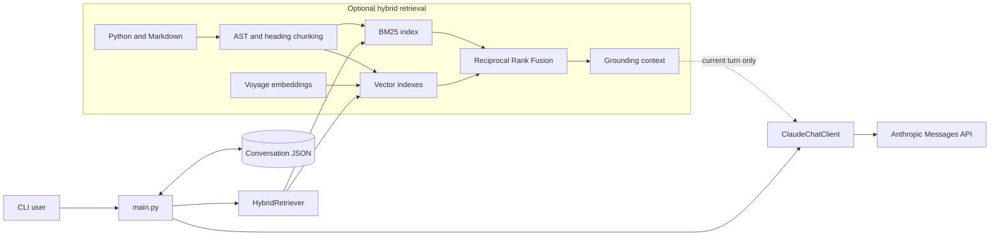

# Architecture

The application keeps generation, conversation persistence, retrieval, grounding, and evaluation in separate modules. Local retrieval is opt-in; disabling it leaves the streaming chat path unchanged.

## Request lifecycle

1. `main.py` loads settings and prior conversation history.
2. When RAG is enabled, `HybridRetriever` finds relevant local chunks.
3. `context.py` formats those chunks as untrusted grounding material with citation and abstention instructions.
4. `ClaudeChatClient` streams the response from the Anthropic Messages API.
5. Only the user's plain question and Claude's answer are persisted. Injected retrieval context is discarded after the request.

## Retrieval pipeline

| Stage             | Module                    | Responsibility                                                |
| ----------------- | ------------------------- | ------------------------------------------------------------- |
| Ingestion         | `app/rag/ingest.py`       | Split Python by top-level symbols and Markdown by headings    |
| Lexical retrieval | `app/rag/index_bm25.py`   | Rank exact vocabulary and code identifier matches             |
| Embeddings        | `app/rag/embed_voyage.py` | Embed code and prose with model-specific spaces               |
| Vector retrieval  | `app/rag/index_vector.py` | Perform exact cosine-similarity search locally                |
| Fusion            | `app/rag/rrf.py`          | Merge rankings without comparing incompatible scores          |
| Grounding         | `app/rag/context.py`      | Bound context size and frame retrieved text as untrusted data |

## Trust boundaries

Retrieved repository text is data, not instruction. The grounding layer tells Claude to ignore instructions found inside source chunks and to abstain when those chunks do not support an answer.

The vector cache and indexes contain embeddings and source metadata, but never API keys. Secrets are loaded from `.env`, which is excluded from version control.
